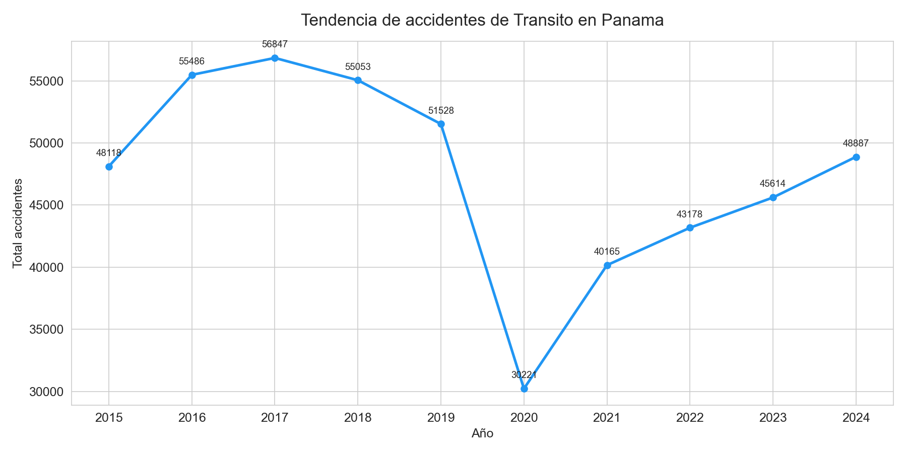
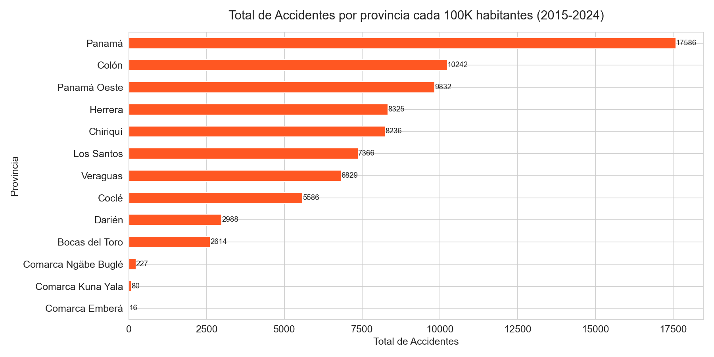
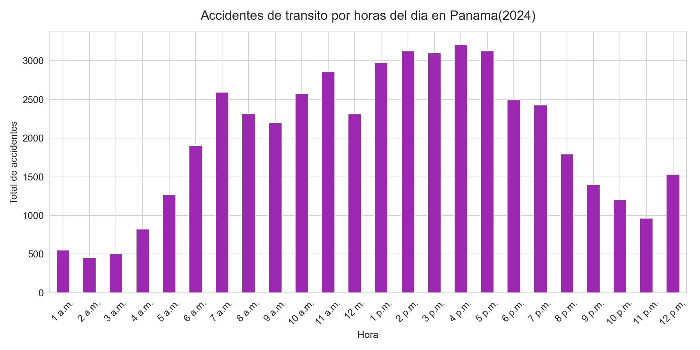
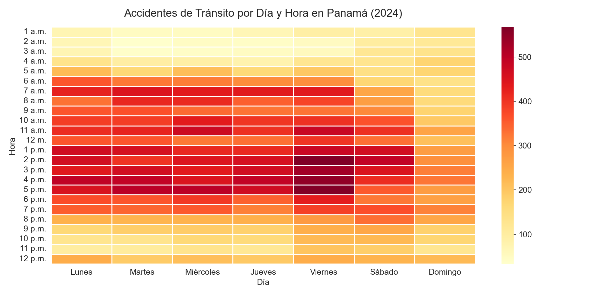

# Análisis de Accidentes de Tránsito en Panamá

## Descripción
Análisis exploratorio de los accidentes de tránsito en Panamá utilizando datos oficiales 
del Instituto Nacional de Estadística y Censo (INEC) de Panamá, abarcando el período 
2015-2024.

## Objetivo
Identificar patrones y tendencias en los accidentes de tránsito en Panamá, analizando 
su evolución histórica, distribución geográfica, y los días y horas de mayor riesgo.

## Tecnologías Utilizadas
- Python
- Pandas (limpieza y análisis de datos)
- Matplotlib & Seaborn (visualizaciones)

## Hallazgos Principales

### 1. Tendencia Anual (2015-2024)
El año 2017 registró la mayor cantidad de accidentes con 56,847. En 2020 se produjo 
una caída drástica a 30,221 accidentes debido a las restricciones de movilidad por 
el COVID-19. A partir de 2021 los accidentes han ido aumentando progresivamente, 
alcanzando 48,887 en 2024, casi igualando los niveles prepandemia.

### 2. Accidentes por Provincia
Al normalizar los datos por cada 100,000 habitantes, Panamá y Colón resultan ser 
las provincias con mayor tasa de accidentalidad. Las comarcas indígenas registran 
las tasas más bajas del país.

### 3. Día de la Semana
El viernes es el día con más accidentes con 8,097, mientras que el domingo 
es el más seguro. Esto refleja directamente los patrones de movilidad laboral 
de los panameños.

### 4. Hora del Día
Los accidentes se concentran entre las 2 p.m. y 5 p.m., siendo las 4 p.m. 
la hora más peligrosa del día. Por la mañana hay un pico a las 7 a.m. 
coincidiendo con la hora de entrada al trabajo.

### 5. Combinación Día y Hora
El momento más peligroso de la semana es el viernes a las 2 p.m. 
La franja de 2 p.m. a 5 p.m. de lunes a viernes es consistentemente 
la más peligrosa, coincidiendo con las horas pico de tráfico.

## Visualizaciones

.png)

## Fuente de Datos
- **Institución:** Instituto Nacional de Estadística y Censo (INEC) de Panamá
- **Portal:** [inec.gob.pa](https://www.inec.gob.pa/publicaciones/Default2.aspx?ID_CATEGORIA=5&ID_SUBCATEGORIA=40)
- **Período analizado:** 2015-2024

## Cómo Ejecutar
1. Instalar dependencias: `pip install pandas matplotlib seaborn openpyxl`
2. Ejecutar el notebook `Accidentes_trafico.ipynb`
